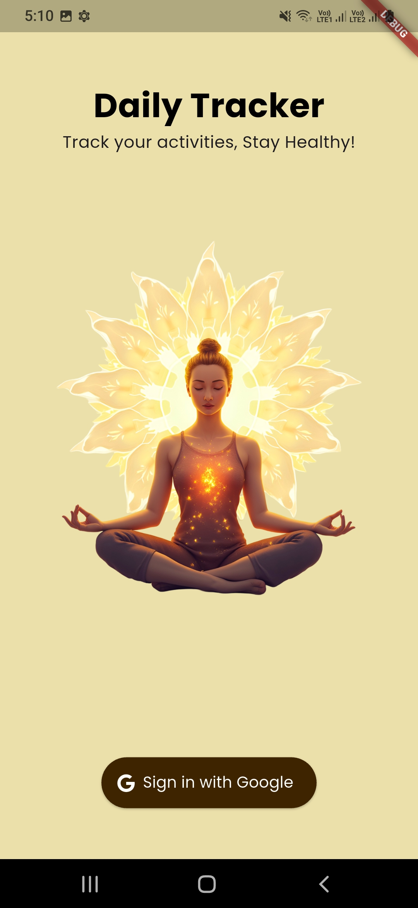
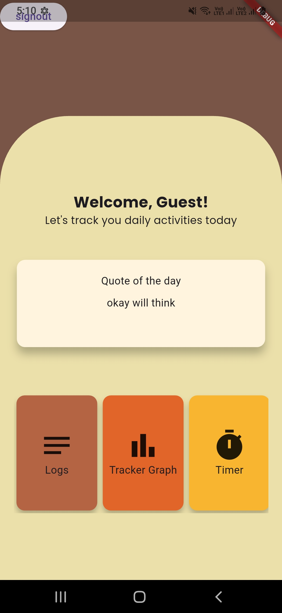
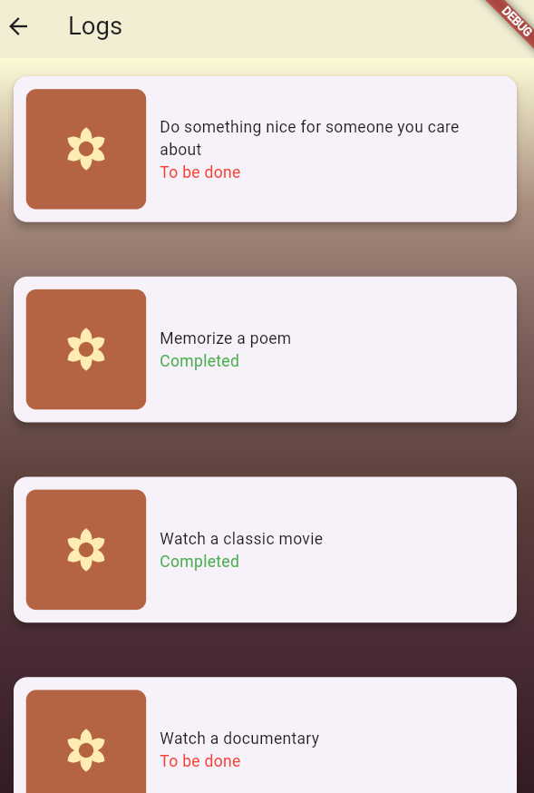
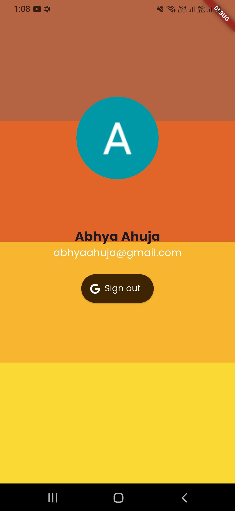

# 🩺 Daily Health Tracker

A Flutter-based **Daily Health Tracker** app designed to help users monitor their health activities with a clean, premium UI.  
The app integrates **Firebase Authentication** for secure login and provides a dashboard with logs, timers, quotes, and graphs to track progress.

---

## ✨ Features
- 🔐 **Firebase Authentication** (Google Sign-In & Sign-Out)
- 📊 **Dashboard** with:
  - Activity logs
  - Timer functionality
  - Profile section
  - Motivational quotes
  - Graphs to track progress
- 🌐 **API Integration** using [DummyJSON Todos](https://dummyjson.com/todos)
- 🎨 **UI Enhancements**:
  - Google Fonts
  - Responsive layouts
  - Premium design with GetX state management

---

## 🛠️ Tech Stack
- **Flutter** (Android focus)
- **Firebase Authentication**
- **GetX** for state management
- **HTTP package** for API calls
- **Google Fonts**
- **DummyJSON API**

---

## 🚀 Installation
1. Clone the repository:
   ```bash
   git clone https://github.com/AbhyaAhuja/DailyHealthTracker.git
   cd DailyHealthTracker
   flutter pub get
   flutter run
   ```

   ## 📸 Screenshots

### 🔑 Sign-In Screen



---

### 📊 Dashboard



---

### 📝 Logs


---

### Profile


---

## 📂 Project Structure
```
lib/
 ├── main.dart
 ├── controllers/        # GetX controllers
 ├── models/             # Data models
 ├── services/           # API & Firebase services
 ├── views/              # UI screens (SignIn, Dashboard, Logs, Profile)
 └── widgets/            # Reusable widgets
```

---

## 🔒 Authentication Flow
1. User signs in with Google.
2. Firebase validates credentials.
3. Dashboard loads with personalized data.
4. User can sign out securely.

---
